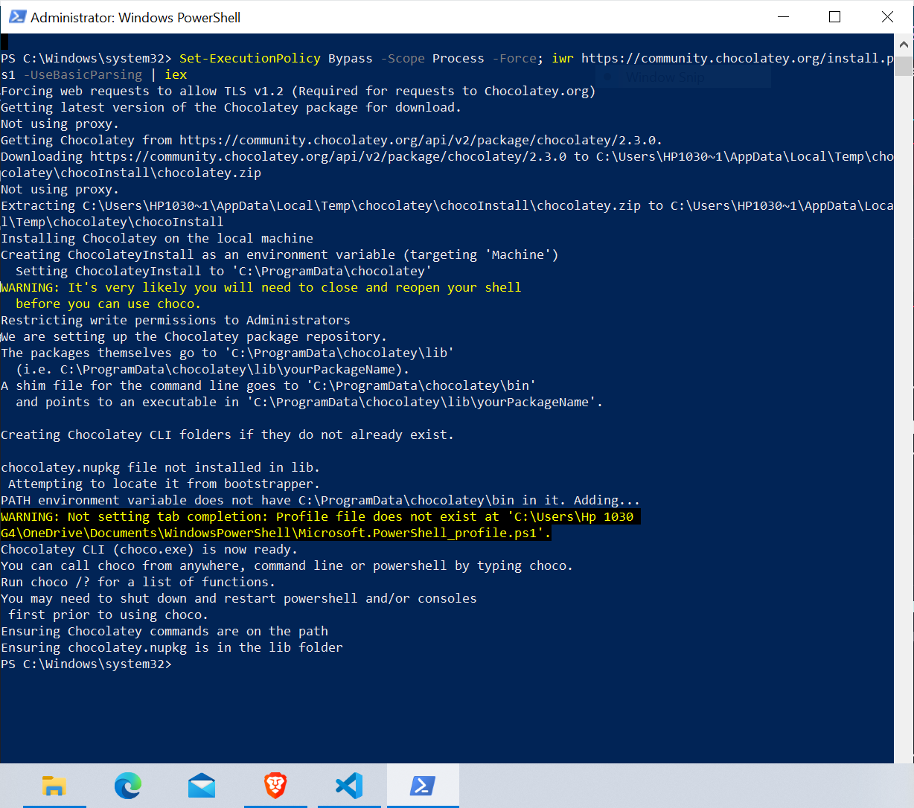
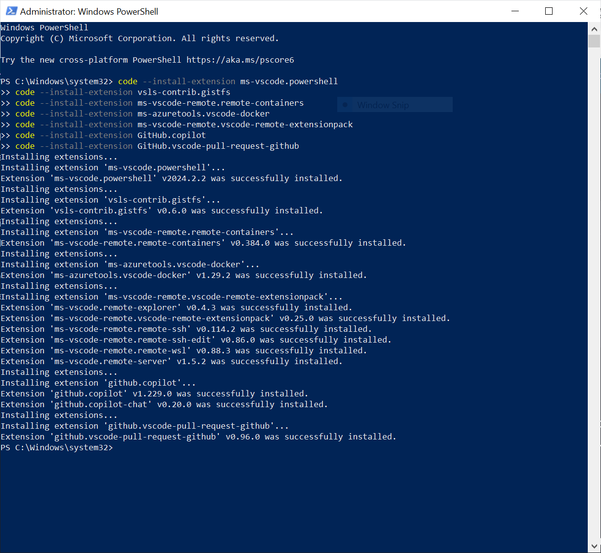
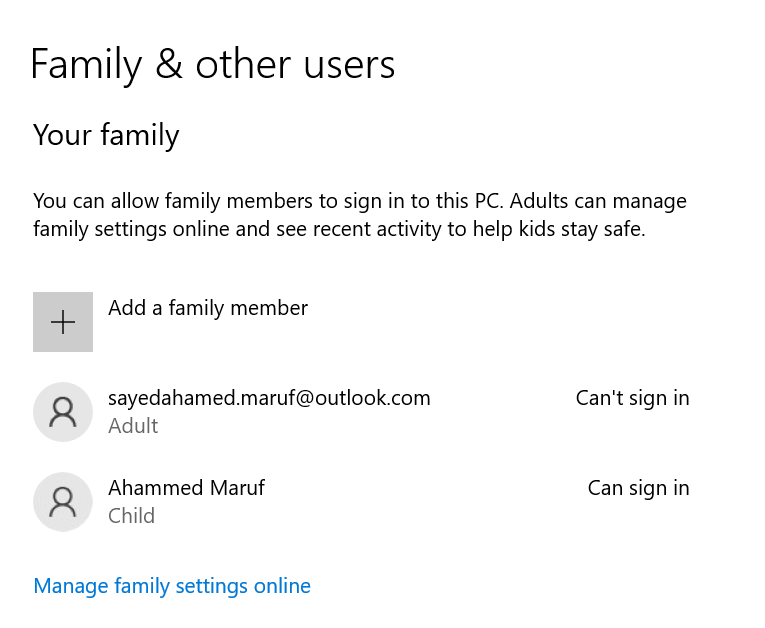

# Learning Diary 1 - BYOD & Basics of Windows

## The purpose of this assignment is to set up your personal devices for educational purposes (HAMK BYOD), get familiar with different tools such vcommander, VDI and to understand the basics of computing.

## Materials (Available in Moodle)
1.	Getting Started & BYOD
2.	Windows Basics

## Step-by-step guide for students

- Please complete the tasks as instructed and include clear screenshots when requested. If screenshot submission is not explicitly mentioned, proceed with the tasks without worrying about screenshots. Just make sure the screenshots are very clear, as unclear screenshots may lead to a score of zero.
- You are required to complete these tasks independently using your own computer. Attempting to copy another student's work will result in a failing grade and will be reported to the head of the program. If you're unsure about something or need assistance, feel free to ask the teacher, but cheating in any form is strictly prohibited.

1.	***Rename your computer***
    1.	Start PowerShell as an administrator and type the following command to rename your computer. The name of the computer should be your **firstnameLastname** that is my computer name will be **deepakkc**.
        ```
        Rename-Computer -NewName "MdMaruf" -Restart
        ```
> Note: Replace "NewComputerName" with your firstnameLastname 

2.	***Basic System Information*** 
    1.	Start PowerShell and run the following command to get the basic system information. **Include a screenshot after running the command below.** 

    ```
    Get-WmiObject Win32_ComputerSystem | Select-Object Manufacturer, Model, TotalPhysicalMemory, UserName
    ```


3.	***Bring your Own Device***
    1.	Go through the guidelines (https://hamk-business-information-technology.github.io/os/index ) & install all required tools in your device. **Include the screenshot of your desktop that verifies the installation of all tools.** 





4.	***User Accounts & Groups*** [Manage user accounts in Windows](https://support.microsoft.com/en-us/windows/manage-user-accounts-in-windows-104dc19f-6430-4b49-6a2b-e4dbd1dcdf32)
    1.	Create a new local user account. The user account type for this user is set to "Family & other users." **Take a screenshot of the newly created user account listed under "Other users."**
    2.	Modify the user account type that you created in the above task to “Standard User” and **take a screenshot.**
    3.	Create a new user group as BIT23 and add the newly created user to this group. **Take a screenshot that verifies you have completed this task.**



 


5.	***Windows File & Folder Level Permissions: [Guide](https://kb.uwec.edu/articles/drives-establishing-windows-file-and-folder-level-permissions)***  
    1.	Create a new folder and name it as “firstname_lastname”. Grant only read and execute permission to a user account created above. **Take the screenshot that shows the permissions of this newly created folder.** 
    2.	Create another folder and name it as “firstname_os”. Grant the following advanced folder level permissions: Traverse folder/ execute file, List folder /read data, Read attributes. **Take the screenshot that shows the permissions of this newly created folder.**
    3.	Create a file that all users can read but only you can modify. **Take a screenshot that verifies you have completed this task.**
    4.	Create a folder and deny access to the folder for a user that you have created above. **Take a screenshot that verifies you have completed this task.**
    5.	Create a subfolder and apply the settings so that the newly created subfolder inherit permissions from a Parent Folder. **Take a screenshot that verifies you have completed this task.**
    6.	Enable auditing for any one of your file to track when users access or modify a file. **Take a screenshot that verifies you have completed this task.**


6.	***Windows Updates & Recovery Options in Windows 11*** (Settings >> Windows Update >> Advanced Options) [Recovery options in Windows](https://support.microsoft.com/en-us/windows/recovery-options-in-windows-31ce2444-7de3-818c-d626-e3b5a3024da5)
    1.	Windows Update: Check for Updates and if any updates are available, you should install updates. 
    2.	Configure Update Settings: Check your current update settings and update if needed how updates are delivered and configure other options according to your preferences.
    3.	Recovery Options: Create a system restore point and give it a name as your firstname_lastname_rpoint. **Take the screenshot of the newly created restore point.**
    4.	Reset your PC: Find how you can reset your PC **however you are not required to reset your PC**. 
    5.	Advance Startup Options: Read Microsoft Documentation on [Windows startup settings](https://support.microsoft.com/en-us/windows/windows-startup-settings-1af6ec8c-4d4a-4b23-adb7-e76eef0b847f) 
    
7.	***Local Storage (System >> Storage))*** 
    1.	View Disk Space Usage: Check your disk space usage and **take a screenshot showing the disk space usage.** 
    2.	Disk Cleanup: Perform the disk cleanup task (Cleanup recommendations) in your device and **take a screenshot showing the Disk Cleanup process**. 
    3.	Optimize Drives: Check one of your drive's fragmentation status. **Take a screenshot after you have analyzed one of your drives.**
    4.	Learn how you can perform the following tasks. You are not required to execute them on your device. You don’t need to submit anything for the partition related tasks. 
        1.	Create a New Partition.
        2.	Extend the newly created partition.
        3.	Shrink a Partition.
        4.	Create a New Volume (Logical Drive).
        5.	Change the Drive letter.
        6.	Format a Partition or Volume
        7.	Delete a Partition
        8.	Convert Disk to GPT or MBR


        


8.	***Network Settings*** 
    1.	View your network status and **take a screenshot** showing  current network you’re connected to and its details.
    2.	View your network properties and check the detailed information like IP address, MAC address, and DNS.
    3.	Check how you can Enable/Disable Network Adapter. If you do not know what is a network adapter, [read here](https://www.techopedia.com/definition/8546/network-adapter)
  
 

8.	***Microsoft Management Console***
    1. Create a custom Microsoft Management Console (MMC)  and list any three tools that you frequently use such as Disk Management(Local), Compute Management (Local), Folder (**Take a screenshot** after you have created and saved the console)

## Guidance and feedback
Guidance is available in class during the lecture.

## Evaluation
The learning portfolio is evaluated as Pass/Fail. You are required to complete all tasks successfully to get a Pass for the learning portfolio.

## Submission
You will complete this assignment and submit it in GitHub Classroom. You will then submit the link to the repository in Moodle(learn.hamk.fi). 
